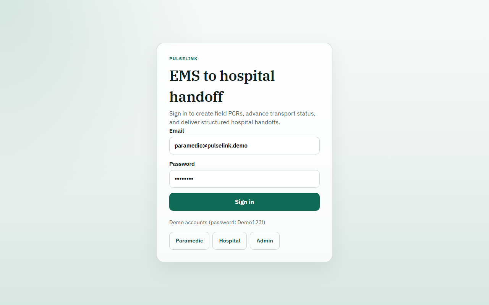
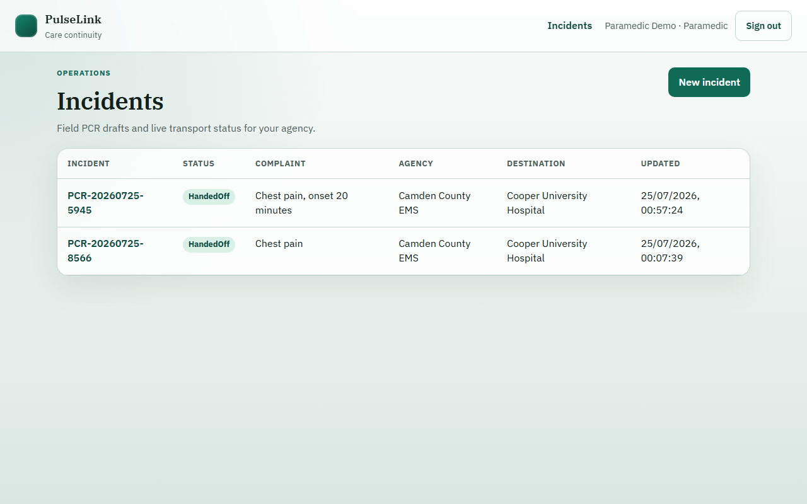
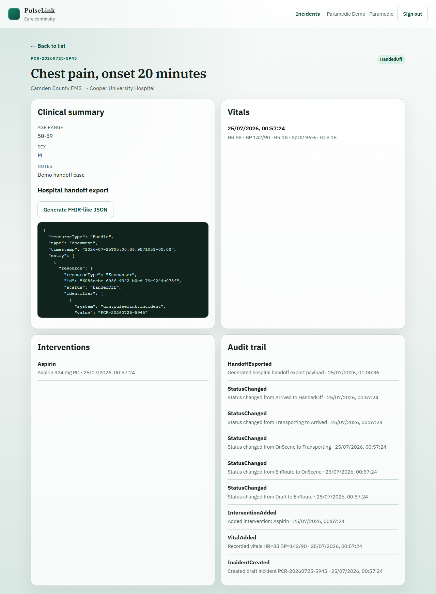
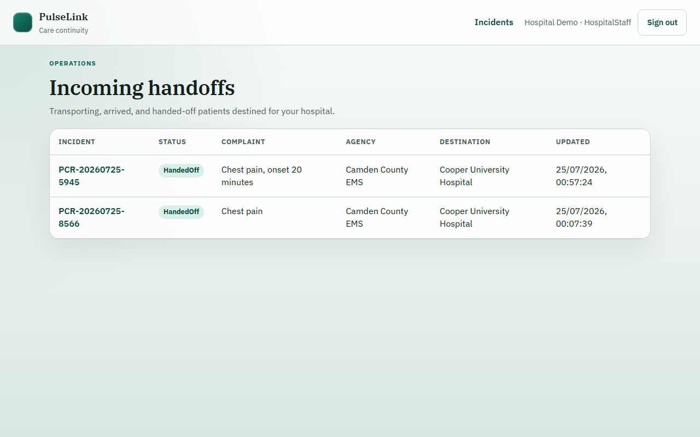

# PulseLink

EMS-to-hospital patient handoff platform.

Paramedics document a lightweight patient care report (PCR) in the field, advance transport status, and deliver a structured handoff summary to receiving hospital staff — with role-based access and an append-only audit trail.

## Stack

- **Backend:** ASP.NET Core 8, C#, EF Core, ASP.NET Identity, JWT
- **Frontend:** React, TypeScript, Vite
- **Database:** SQLite locally by default; SQL Server is a second provider (see [docs/database.md](docs/database.md))
- **Tests:** xUnit
- **CI:** GitHub Actions

## Quick start

### Prerequisites

- .NET 8 SDK
- Node.js 20+

### API

```bash
cd backend/PulseLink.Api
dotnet run
```

- API: http://localhost:5080
- Swagger: http://localhost:5080/swagger

### UI

```bash
cd frontend
npm install
npm run dev
```

- App: http://localhost:5173

Vite proxies `/api` to the API during local development.

### SQL Server (optional)

SQLite is the default. SQL Server is a second EF provider (`Database:Provider=SqlServer`) with its own migration set.

On Windows without Docker, LocalDB is the verified path:

```bash
sqllocaldb start MSSQLLocalDB
cd backend/PulseLink.Api
dotnet run --launch-profile http-localdb
```

Where Docker is available:

```bash
docker compose up -d
cd backend/PulseLink.Api
dotnet run --launch-profile http-sqlserver
```

`docker-compose.yml` is documented; it has not been run as part of the LocalDB verification. Provider settings, both `--context` migration commands, and startup-vs-deploy migrate: [docs/database.md](docs/database.md). List indexes: [docs/performance.md](docs/performance.md).

### Tests

```bash
dotnet test PulseLink.sln
```

List ordering is also run against SQL Server LocalDB when it is present. Those facts skip in CI (Ubuntu has no LocalDB).

## Seeded local users

| Role | Email | Password |
|------|-------|----------|
| Paramedic | `paramedic@pulselink.demo` | `Demo123!` |
| Hospital staff | `hospital@pulselink.demo` | `Demo123!` |
| Admin | `admin@pulselink.demo` | `Demo123!` |

See [docs/demo-walkthrough.md](docs/demo-walkthrough.md) for a guided local walkthrough.

## Screenshots

| Login | Paramedic incidents |
| --- | --- |
|  |  |

| Incident detail + export | Hospital handoffs |
| --- | --- |
|  |  |

## Core workflow

1. Paramedic creates a draft incident (chief complaint, destination hospital)
2. Records vitals and interventions as normalized rows
3. Advances status: `Draft → EnRoute → OnScene → Transporting → Arrived → HandedOff`
4. Hospital staff reviews the handoff for their facility
5. Authorized users can generate a FHIR-inspired export via `GET /api/incidents/{id}/export`

## Project layout

```text
PulseLink/
  backend/
    PulseLink.Api/             HTTP + JWT + controllers
    PulseLink.Core/            Entities + status machine
    PulseLink.Infrastructure/  EF Core, Identity, seed data
    PulseLink.Tests/           Domain, data, and API tests
  frontend/                    React + TypeScript UI
  docs/                        Architecture, walkthrough, database, performance
```

## Design highlights

- Explicit incident status state machine with hospital-required gates
- Relational vitals/interventions (not a single JSON blob)
- Role-scoped queries (agency vs destination hospital)
- Audit events on create/update/status/export
- Integration stub export for hospital systems

More detail: [docs/architecture.md](docs/architecture.md). List query indexes: [docs/performance.md](docs/performance.md).

## Deployment notes

The data model supports SQLite (local default) and SQL Server. Typical cloud layout: API on Azure App Service, frontend on Azure Static Web Apps, JWT signing key in App Settings or Key Vault, Azure SQL with `Database:Provider=SqlServer`. See [docs/database.md](docs/database.md) and the architecture doc for concrete steps.
